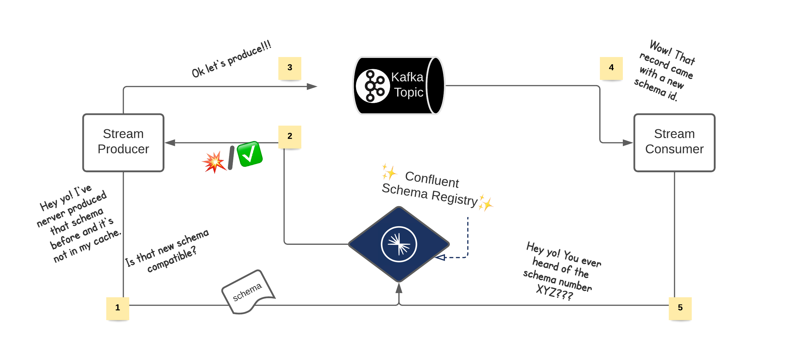
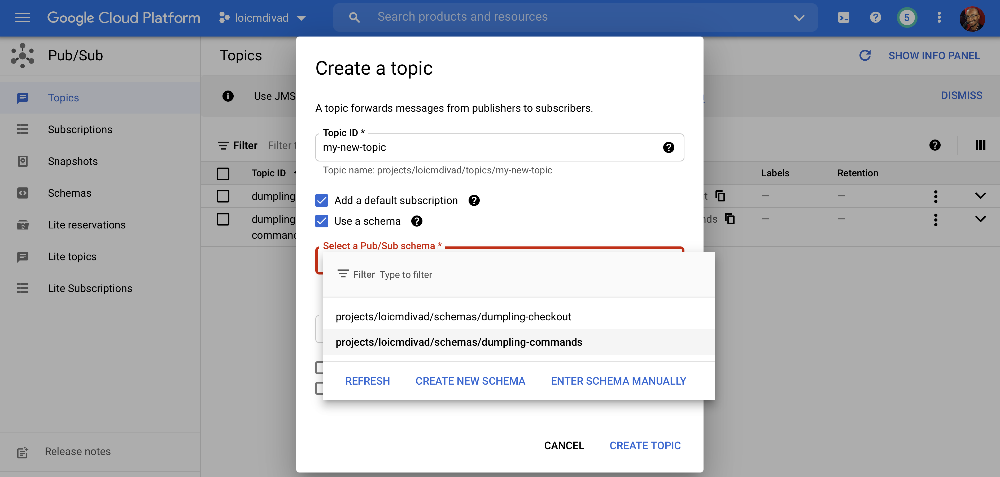
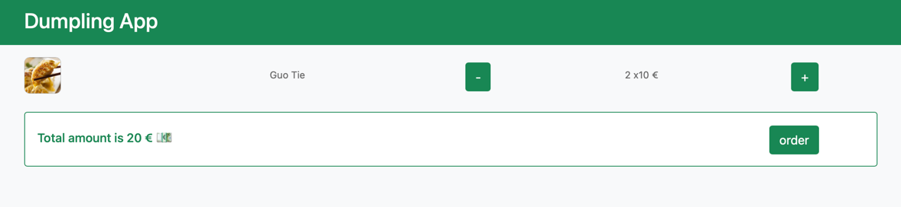
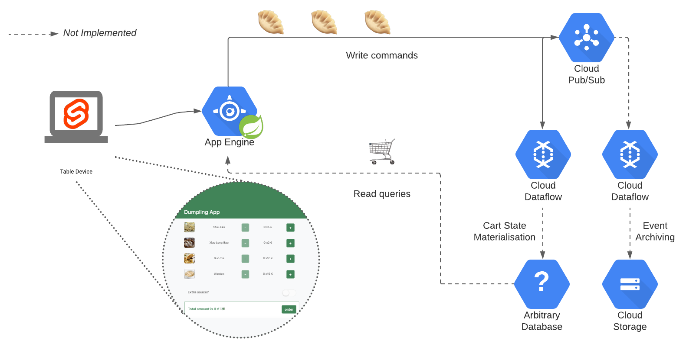
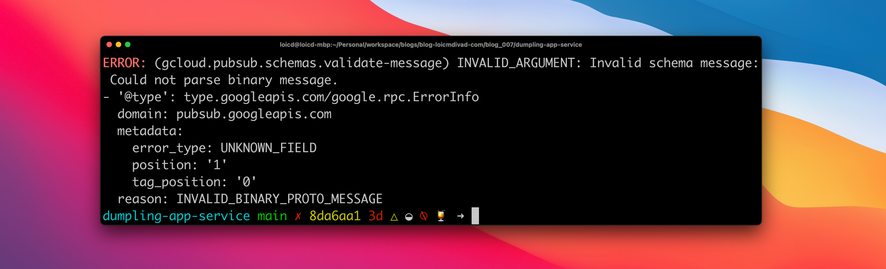
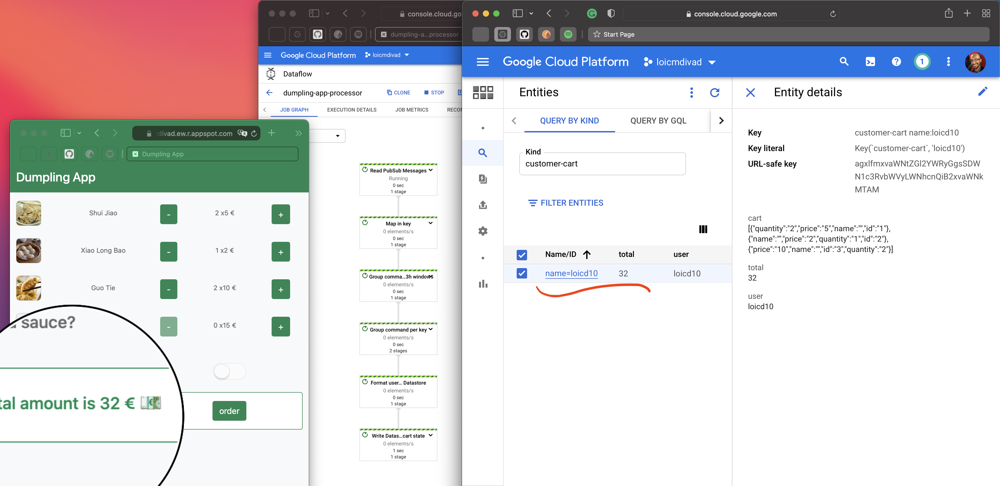

This article aims to discuss data contracts in the context of event processing applications. We will
follow a short example: The Dumpling App! The post also looks at that concept through specific
technologies. [Pub/Sub message schemas](https://cloud.google.com/pubsub/docs/schemas) is a
relatively recent feature, so let's take it for a spin in that article.

- [Motivation](#motivation)
- [Pub/Sub Message Schemas](#pubsub-message-schemas)
- [Use case example: The Dumpling App](#use-case-example-the-dumpling-app)
    - [Infrastructure](#infrastructure)
    - [Schema](#schema)
    - [Service and interface](#service-and-interface)
- [Schema Enforcement](#schema-enforcement)
- [Message Consumption](#message-consumption)
- [Conclusion](#conclusion)

## Motivation

Event oriented architectures are powerful. They provide advanced audit capability, replayability and
flexibility. But to enjoy all those features, the different applications have to interact safely
with each other. Similarly to how a team would create API specifications (with a WSDL when using
SOAP) there is a need to declare the shape of events flowing in a stream. The name and the type of
the different fields usually completely describe the structure of the events. It is commonly called
event schema. This post will refer to the association of schema and materialized stream of events (
i.e. topic, message queue ...) as a data contract.

One tool managing this type of data contract is
the [Confluent Schema Registry](https://docs.confluent.io/platform/current/schema-registry/index.html)
. When assigning a schema to the keys or values of a Kafka topic, the Schema Registry creates a new
entry called subject. This subject is then exposed and provides consistency at a message level.

- This contract enforces the structure of future messages
- This contract informs on the way to read existing messages



The Confluent Schema Registry has been around for a while and readers might be more familiar with
it. On the opposite, organise a project around this recent Pub/Sub feature might be less obvious.
This post tries to highlight the practices and techniques one can think of when working with Message
Schemas. So let’s explore data contracts with Cloud Pub/Sub!

## Pub/Sub Message Schemas

GCP introduced the Message Schemas feature
in [March 2021](https://cloud.google.com/pubsub/docs/release-notes#March_01_2021) and moved it
to [GA in June](https://cloud.google.com/pubsub/docs/release-notes#June_30_2021). It lets you
declare an AVRO or Protobuf schema as a cloud resource. You can then point at that resource when
creating a topic. Let's see what happens next.



## Use case example: The Dumpling App

Let be the Dumpling Store, a small fictional restaurant that serves dumplings. Let's also imagine
that at each table has a small device providing an interface to order food. Each time you click on
add an item, the app publishes an event to add a line to your order. Once you click on order, the
app sends the second type of event to prepare your order. It's basically similar to the
Self-Ordering kiosk of your favourite fast food.
The [dumpling-app](https://github.com/DivLoic/blog-loicmdivad-com/blob/main/blog_007/) is a preview
what this application could look like by using Pub/Sub Message Schema.




{{< shoutout name="Febrian Zakaria"
picture="https://unsplash.com/@febrianzakaria?utm_source=unsplash&utm_medium=referral&utm_content=creditCopyText"
profile="https://unsplash.com/s/photos/dumpling?utm_source=unsplash&utm_medium=referral&utm_content=creditCopyText" >
}};

{{< shoutout name="Marta Filipczyk"
picture="https://unsplash.com/@martafilipczyk?utm_source=unsplash&utm_medium=referral&utm_content=creditCopyText"
profile="https://unsplash.com/s/photos/tablet?utm_source=unsplash&utm_medium=referral&utm_content=creditCopyText" >
}}

The application
is ([dumpling-app-service](https://github.com/DivLoic/blog-loicmdivad-com/blob/main/blog_007/dumpling-app-service/))
composed of a [Svelte](https://svelte.dev) web app, and a Spring Boot web service running in App
Engine. The service produces events in a Pub/Sub topic. From here, a Dataflow job continuously
processes the events.



### Infrastructure

The team building and running the application might also be responsible for the cloud resources.
That’s why at the root of the project, a terraform directory contains the different infrastructure
manifests. Luckily for the Dumpling team,
the [GCP terraform provider](https://registry.terraform.io/providers/hashicorp/google/latest/docs)
allows the declaration of schemas.

```hcl ## {linenos=table}
resource "google_pubsub_schema" "commands" {
  name = "dumpling-commands"
  type = "PROTOCOL_BUFFER"
  definition = file("${path.module}/../../src/main/proto/command.proto")
}
```

See the entire
file: [schemas.tf](https://github.com/DivLoic/blog-loicmdivad-com/blob/main/blog_007/dumpling-app-service/terraform/pubsub/schemas.tf)
.

This would be the equivalent of the following gcloud command line:

```bash
gcloud pubsub schemas create dumpling-commands \
        --type=PROTOCOL_BUFFER \
        --definition=$(cat src/main/proto/command.proto)
```

An interesting aspect of this setup is that we define schemas only once. Both Terraform and the code
generation load the same file. Terraform does it with the `file()`
function ([line 10](https://github.com/DivLoic/blog-loicmdivad-com/blob/a65d0fa932670995e71d1a0364ffbe4560c1c37f/blog_007/dumpling-app-service/terraform/pubsub/schemas.tf#L10))
and the code generation (with the Protobuf Maven
Plugin ([line 143](https://github.com/DivLoic/blog-loicmdivad-com/blob/a65d0fa932670995e71d1a0364ffbe4560c1c37f/blog_007/dumpling-app-service/pom.xml#L143))
. Next, the different Pub/Sub topics depend on and reference the schemas.

```hcl {linenos=table,hl_lines=[5],linenostart=12}
resource "google_pubsub_topic" "commands" {
  # [...]
  depends_on = [google_pubsub_schema.commands]
  schema_settings {
    schema   = "projects/${var.gcp_project}/schemas/${google_pubsub_schema.commands.name}"
    encoding = "BINARY"
  }
}
```

See the entire
file: [topics.tf](https://github.com/DivLoic/blog-loicmdivad-com/blob/main/blog_007/dumpling-app-service/terraform/pubsub/topics.tf)
.

Now, let's dig into the schema file itself and how the rest of the application uses it.

### Schema

In our example, the team is using the Protobuf serialisation system. The structure needs to be flat.
So far, the Message Schemas feature does not support imports or complex types. The add `(+)` and
remove `(-)` buttons are associated with the `Command` event, which has the following shape:

```protobuf
message Command {
  int64 event_time = 1;
  string item_id = 2;
  string item_name = 3;
  enum Operation {
    ADD = 0;
    REMOVE = 1;
  }
  Operation operation = 4;
  message Session {
    string user_id = 1;
    string table_id = 2;
    string store_id = 3;
  }
  Session session = 5;
}
```

The message ordering key is the `user_id`. Every event carries an `event_time` set by the front-end
app and a type of Operation to specify if the item should be added or removed from the user cart.
The application set some attributes such as env, version, source. But in addition to those
attributes the client library adds two technical attributes relate to the message schema

|Attributes                  | Value example           |
|----------------------------|-------------------------|
|`googclient_schemaencoding` | BINARY / JSON           |
|`googclient_schemaname`     | projects/`?`/schemas/`?`|

### Service and interface

The HTTP API is just a typical Spring Boot module. One special thing about it is that it does not
present any entities or model package filled with POJO. Instead, the application only uses the
result of the Protobuf code generation as the data model. The `command.proto` file from the previous
paraph gives a `Command.java` class. The Spring Boot module applies automatic conversion of Protobuf
to JSON to interact with the front-end.

```java {linenos=table,hl_lines=[6],linenostart=17}
@Bean
ProtobufJsonFormatHttpMessageConverter protobufHttpMessageConverter() {
  final ProtobufJsonFormatHttpMessageConverter protoConverter = 
      new ProtobufJsonFormatHttpMessageConverter();
  protoConverter
    .setSupportedMediaTypes(singletonList(MediaType.APPLICATION_JSON));
  return protoConverter;
}
```

Finally, the single-page web app is a Svelte module. The Spring Boot module considers
the [Svelte output as a resources directory](https://github.com/DivLoic/blog-loicmdivad-com/blob/8da6aa1752cf97bda2e5c7e1492a78aecc5dbeb9/blog_007/dumpling-app-service/pom.xml#L99)
. The page is not pretty, but don't be mean at the Dumpling team, "they" are not great at front-end
development.

> Every time I write Javascript, a kid loses a balloon -- _Loïc DIVAD_

Here is a short video showing the app publishing records in the input topic. We can observe the
series of events, in the console, by consuming them back via
a [debugging tool](https://github.com/DivLoic/blog-loicmdivad-com/tree/main/blog_007/dumpling-cli)
created for the presentation.

   
[](http://www.youtube.com/watch?v=WMCgi3e28B4)

That concludes the chapter on the application. We have listed a few things that one could put in
place to organise around the idea of event schema. Now let's try to capture the impact of the usage
of this feature on external teams or components.

## Schema Enforcement

It turns out another team is working on the same app. This other team works separately on a new
feature: a checkbox giving access to some additional sauce. Let’s call them the Sauce team. The
problem here is that they have started to work in isolation. They have implemented the feature with
a completely different schema. And yet, they try to publish messages on the same topic. It is
dangerous for consumers who assume that this topic contains an order event and try to decode it. By
nature, most of the applications based on events are continuous and long-running processes. They can
not suffer from crashes due to an invalid type of message. Otherwise, while these applications are
down, some lag will start to build up.

Here is a short video showing the behaviour of the application when clicking on the new button. When
the server tries to publish the messages from the checkbox, it fails with an Exception??? And return
a 500 error code. Hopefully, the team handle that response correctly. They display a warning and
toggle off the extra sauce option.

   
[](http://www.youtube.com/watch?v=ugKy5ZbzF3E)

In the future, the sauce team will want to fix this problem. It turns out Cloud Pub/Sub provides an
API to check a message against an existing Pus/Sub Message Schema. By giving the body of the message
and a schema name, the API tells you if it is correct. It helps to comply with existing data
contracts.

```bash {linenos=false}
gcloud pubsub schemas validate-message \
        --message-encoding=BINARY \
        --message=$(cat ./test.json) \
        --schema-name=dumpling-commands
```



One can perform the same verification with the user interface cloud console.

## Message Consumption

Now let's move to another aspect of working with schema: Message consumption. Let's imagine a third
team that would build another type of application, this time, a stream processing app. Using
Dataflow, they are gathering all user interaction events to compute their shopping cart in
real-time.
The [dumpling-app-processor](https://github.com/DivLoic/blog-loicmdivad-com/blob/main/blog_007/dumpling-app-processor)
is a simplistic module representing this idea. The very first step is to consume and deserialise the
input records.

```java {linenos=table,hl_lines=[4]}    
Pipeline pipeline = Pipeline.create(options);

pipeline
    .apply("Read PubSub Messages", PubsubIO.readProtos(Command.class))
```

For this reason, we quickly realise that we need the schema we've introduced before in this module
too. How to share it?

The service team produces that data, and at the moment, owns the corresponding schema. The
processing team should definitely not copy the schema into its module. Instead, we can think of a
plugin to resolve the schema dependency before running the code generation. Tools such
as [protoman](https://github.com/spotify/protoman) exist, but they mostly come with their own
registry. In our example, we want to integrate the Google Cloud API as a source of thought for the
schema.

[pubsub-schema-maven-plugin](https://github.com/DivLoic/blog-loicmdivad-com/tree/main/blog_007/pubsub-schema-maven-plugin)
is a quick implementation of that idea. It is a maven plugin that the processing team could use to
fetch the schema.

```xml

<plugin>
    <groupId>fr.ldivad.dumpling</groupId>
    <artifactId>pubsub-schema-maven-plugin</artifactId>
    <version>0.1.0-SNAPSHOT</version>
    <configuration>
        <project>${gcp.project}</project>
        <schemas>
            <schema>dumpling-commands</schema>
            <schema>dumpling-checkout</schema>
        </schemas>
    </configuration>
    <executions>
        <execution>
            <phase>generate-sources</phase>
            <goals>
                <goal>proto-files</goal>
            </goals>
        </execution>
    </executions>
</plugin>
```

After reading the commands, the Dataflow job maps them in key-value pairs. The job groups the pairs
by key over a large time window. A trigger is a setup so that quickly after a state update, the job
will emit the new state of the shopping cart. Finally, this example writes in Datastore (which is
just an arbitrary choice to get simple feedback for the job)

```java {linenos=table}    
pipeline
    .apply("Read PubSub Messages", readFromPubSub)

    .apply("Map in key/value pairs", new KeyValueCommandMapper().map())

    .apply("Group command in 3h windows", CommandProcessor.windowingCommand())

    .apply("Group command per key", Combine.perKey(new CommandAggregator()))

    .apply("Format user cart for Datastore", ParDo.of(new CartEntityMapper()))

    .apply("Write Datastore cart state", writeInDatastore);

```

See the entire
file: [Main.java](https://github.com/DivLoic/blog-loicmdivad-com/blob/main/blog_007/dumpling-app-processor/src/main/java/fr/ldivad/dumpling/Main.java)
.



This is an oversimplified example. But still, it is concrete enough to start imagining how we could
build materialised views in this context. Those views would contribute to a read model similar to
the one we rely on when using CQRS or other event-sourcing patterns.

## Conclusion

We have seen the benefice of having a data contract in place through this demo example. The data
contract protects the application against its own failure by enforcing the type of message for a
topic. And it helps the other application to decode those messages. However, in the particular case
of the Pub/Sub Message Schemas feature, the advantages fall short. The feature is really new (about
a year at the publication of this post), and there are still a few options missing. The biggest
being schema evolution. At the moment, topics can not have new schemas. And if a used schema is
deleted, the publications for that topic will simply fail. But when thinking about it makes sense
for the early beginning of this feature. Because adopting schema is not easy. And establishing
compatibility levels is also quite tricky. Having a zero compatibility level policy is a way to put
a lower entry barrier on schema management. Similarly, the support for Pub/Sub Lite, the support for
complex types or imports in Protobufs schema, feel like options that should be present but are
missing at the moment. That is why we might see many exciting things coming into that product in the
future.
